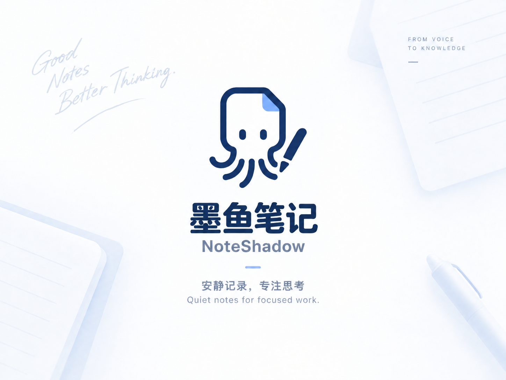
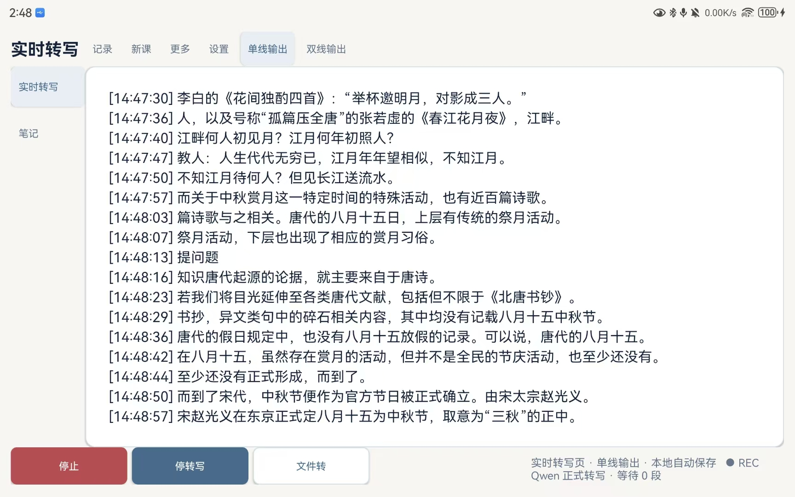
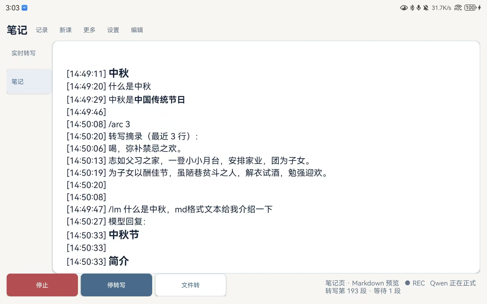
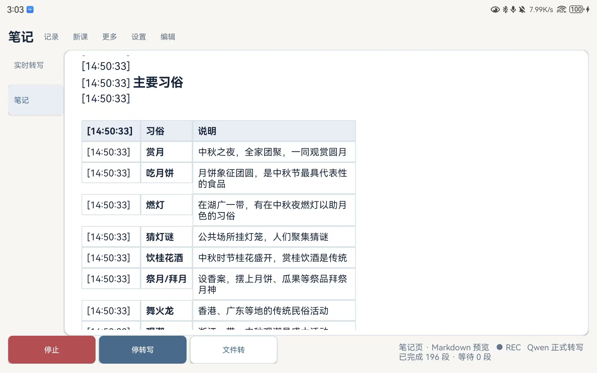
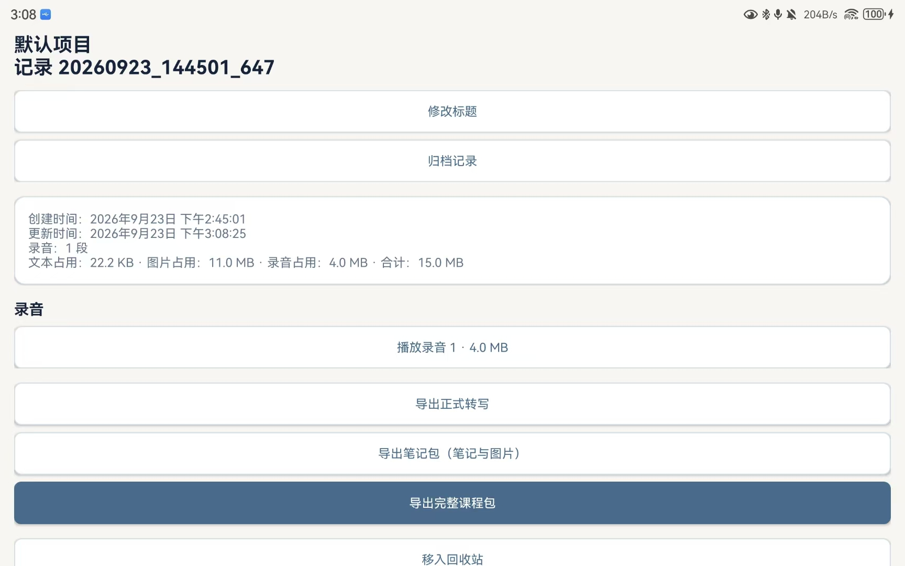

# NoteShadow · 墨鱼笔记

[简体中文](README.md) · [Full user guide](docs/USER_GUIDE.en.md) · [Changelog](CHANGELOG.md) · [Third-party notices](THIRD_PARTY_NOTICES.md)



**Record, transcribe, and organize classes or meetings on your tablet while keeping control of your notes.** NoteShadow is an Android tablet app for local audio capture, on-device speech recognition, and course notes. An optional model interface can assist with writing when you explicitly invoke it.

> **Project status:** The `0.5.1` preview APKs are public while device validation continues. Read [Download preview APKs](#download-preview-apks) and the [full user guide](docs/USER_GUIDE.en.md) first.

## At a glance

| Live transcription | Timestamped notes |
| --- | --- |
|  |  |
| Follow on-device transcription while recording and retain a formal transcript. | Write notes alongside recording and transcription, with timestamps on new lines. |

| Markdown preview | Course records and exports |
| --- | --- |
|  |  |
| Preview headings, lists, tables, code, and images in the app. | Review audio and transcripts, then export a note package or full course package. |

Screenshots show the current development UI; the eventual release may change.

## Features

- **Recording and offline transcription:** Save AAC/M4A audio and transcribe live speech or an audio file with on-device models. The live view offers single-output and optional dual-output modes. The `full` APK includes the Qwen model needed by the default mode; `lite` requires models to be installed separately.
- **Course notes:** Write timestamped Markdown while transcription continues, capture or import images, and switch between source editing and read-only preview. `/arc [n]` inserts recent formal transcript lines without calling an online model.
- **Records and export:** Organize records by project, search transcripts, archive or restore records, and export formal transcripts, notes with images, or complete course packages including recordings.
- **Local reading:** Import TXT/EPUB documents with independent progress. An optional dual-output view can temporarily mix reading text into the display; formal transcript exports exclude it.
- **Optional model chat:** Explicit `/lm` commands send your question and earlier successful model turns from the same course to a provider you configure. This feature requires network access and your own credentials.

## Privacy and data

Recording, offline speech recognition, reading, and ordinary notes require no account or cloud service. When you use the optional model feature, the app sends only the question you explicitly submit and previous successful model turns from that course to the selected service. It does not automatically upload recordings, transcripts, reading documents, or unrelated notes. API keys are configured on the device and are not bundled in the APK. System cloud backup is disabled; device transfer behavior on Android 12 and later may vary by manufacturer. On Android 10 and later, each completed recording is also copied to public `Music/NoteShadow`. Deleting a course record removes its app-private copy, not that public copy or prior exports. See [Privacy and data](PRIVACY.md).

## Download preview APKs

The [v0.5.1 preview release](https://github.com/JiBinquan/NoteShadow-OpenSource/releases/tag/v0.5.1) offers two packages. `full` bundles Qwen3-ASR, Zipformer, SenseVoice, and Silero VAD; it copies Qwen3 to app-specific storage on first use. `lite` omits all models; install them separately as described below to use offline transcription. Both packages have the same application ID, version, and signing certificate: they are two builds of the same app. The release page lists SHA-256 checksums and model attribution.

This preview has not completed device regression testing. When upgrading an existing v3 installation, preserve its app data and do not uninstall it to work around a signature mismatch; compare the release certificate fingerprint before installation.

## Build from source

The supported build script uses Windows PowerShell. You need Git LFS, JDK 11 or 17, Android SDK 31, and Build Tools 31.0.0. The app's minimum Android version is 6.0 (API 23); the bundled sherpa-onnx native library targets ARM64. Landscape tablets are the primary design target, while other form factors need further validation.

```powershell
git lfs install
git clone https://github.com/JiBinquan/NoteShadow-OpenSource.git
cd NoteShadow-OpenSource
```

Set your SDK path in an untracked `local.properties`, for example `sdk.dir=C:/Android/Sdk`. Use `-Online` on the first build so dependencies can be downloaded:

```powershell
.\scripts\build.ps1 -Online
```

The script runs JVM unit tests and builds a Debug APK. You can omit `-Online` once dependencies are cached. The script requires ASCII-only paths for the project and Gradle cache; see [Testing](docs/engineering/TESTING.md). To compile a Release build, run `.\scripts\build.ps1 -Tasks assembleRelease`. Without local signing material, that APK is not a distributable update. Updating an installed app requires the same application ID and signing certificate, plus a higher `versionCode`.

**Model setup:** The public source snapshot contains no speech models or test audio. For offline transcription, obtain compatible models you have the right to use and place them under the device's app-specific `Android/data/com.noteshadow.app3/files/models/` directory: Qwen3-ASR INT8 in `qwen3-int8/` (formal live and file transcription), Zipformer INT8 in `zipformer-int8/` (live draft), SenseVoice INT8 in `sensevoice-int8/` (compatibility mode), and Silero VAD in `silero-vad/`. `LocalSherpaAsr` and `AudioFileTranscriber` check the required filenames. A mode cannot start without its models; recording, notes, and record management remain available. Users must verify the source and license of any models they provide.

## Documentation and contributions

- [Full user guide](docs/USER_GUIDE.en.md) · [Architecture](ARCHITECTURE.md) · [Build and testing](docs/engineering/TESTING.md) · [Release process](docs/engineering/RELEASE_PROCESS.md)
- [Changelog](CHANGELOG.md) · [Roadmap](docs/ROADMAP.md) · [Contributing](CONTRIBUTING.md) · [Security](SECURITY.md) · [Report an issue](https://github.com/JiBinquan/NoteShadow-OpenSource/issues)

Before contributing, read [AGENTS.md](AGENTS.md) and the [coding standards](docs/engineering/CODING_STANDARDS.md). Do not include real recordings, notes, or API keys in issues, screenshots, or test data.

## License and distribution

Original NoteShadow code and documentation are licensed under [Apache License 2.0](LICENSE). The project's banner, launcher icon, and demonstration screenshots use [CC BY 4.0](ASSETS_LICENSE.md). Third-party code, native libraries, models, and test audio retain their own terms; see the [third-party notices](THIRD_PARTY_NOTICES.md).
